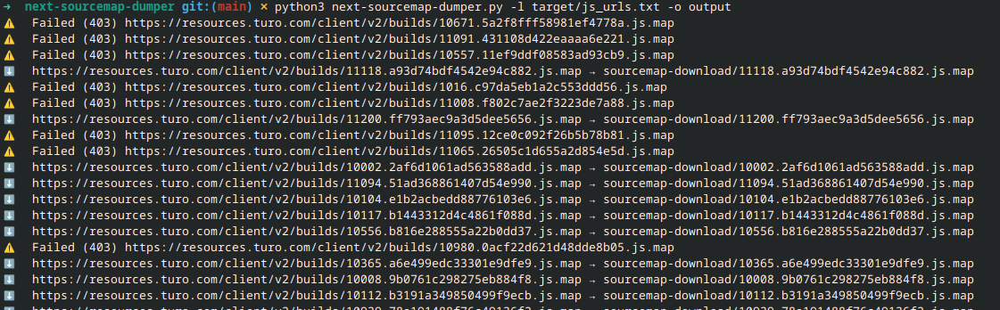
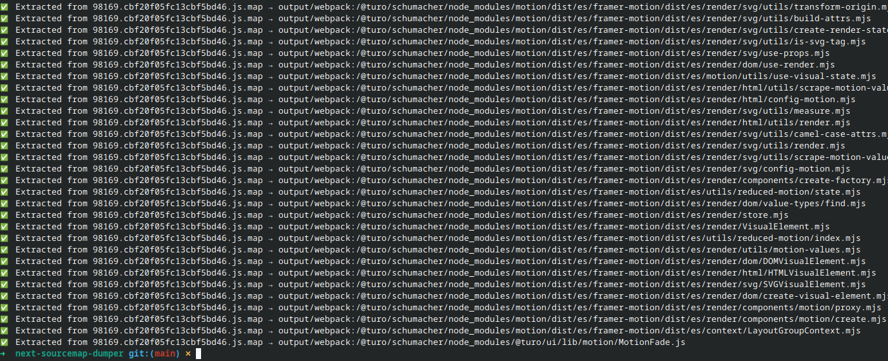
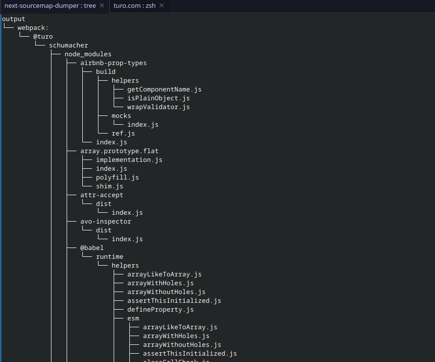

<p align="center">
  
</p>

<h1 align="center">Next.js Source Map Dumper</h1>

A simple command-line tool to **download `.js.map` files from Next.js applications and extract the original TypeScript or JavaScript source files**.

---

## 🚀 Key Features

|                                      |                                                                          |
| ------------------------------------ | ------------------------------------------------------------------------ |
| ⚡ **Automatic `.map` discovery**     | Appends `.map` to every supplied script URL (/\_next/static/…)           |
| 🚄 **Concurrent downloads**          | Multithreaded fetcher speeds up large dumps                              |
| 🗂 **Folder‑structure preservation** | Reconstructs original project paths from `sourcesContent`                |
| 🧑‍💻 **Next.js‑aware**              | Works seamlessly with Next.js chunk names, build IDs, and code‑splitting |
| 🔌 **CLI‑friendly**                  | Simple flags, easy automation, zero external configs                     |

---

## 🖼 Example Screenshots

### ▶️ Run

```bash
python3 next-sourcemap-dumper.py -l target/js_urls.txt -o output
```

<p align="center">
  
</p>

### ✅ Finished

<p align="center">
  
</p>

### 📁 Output Folder Tree

<p align="center">
  
</p>

---

## 🛠 Installation

```bash
# clone & install deps
 git clone https://github.com/yourusername/nextjs-sourcemap-dumper.git
 cd nextjs-sourcemap-dumper
 pip install -r requirements.txt
```

---

## 💡 Usage

```bash
python extract_sourcemaps.py -l js_urls.txt -o extracted_sources
```

| Flag | Description                                                                  |
| ---- | ---------------------------------------------------------------------------- |
| `-l` | **Required.** Path to a text file containing one Next.js script URL per line |
| `-o` | **Required.** Destination directory for the recovered sources                |
| `-c` | *(optional)* Number of parallel download workers (default = CPU×2, max 32)   |

---

## 📥 Input Example

Create `js_urls.txt` like so:

```
https://example.com/_next/static/chunks/546.cbd432.js
https://cdn.site.io/_next/static/chunks/webpack.js
https://myapp.net/_next/static/chunks/pages/dashboard.1a2b3c.js
```

The tool will attempt to fetch:

```
https://example.com/_next/static/chunks/546.cbd432.js.map
https://cdn.site.io/_next/static/chunk
```
